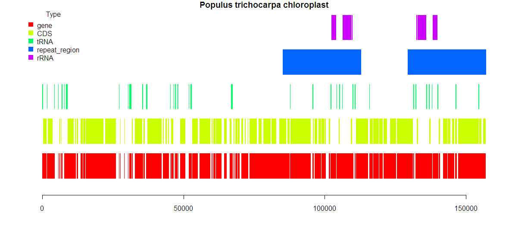

plotGFF
=======

`plotGFF(x, ...)` is an R function to produce a simple graphical plot of the annotatation contained within a GFF file.  The GFF annotations in `x` are first loaded using the `import.gff(file, version="3")` functions from the BioConductor package `rtracklayer`.  These are then passed as `x` to `plotGFF(x, ...)`, together with other options.

There is a `sites` argument that allows tracks of sites (e.g., SNP locations/frequencies) to be added at specific positions within the GFF plot.  The `main` argument can be used to specify a title for the plot.

`plotGFF()` requires the BioConductor packages `rtracklayer`, `IRanges` and `Biostrings`.

`plotGFF()` is a simple script and was not designed to be particularly robust nor to be used for large (greater than a few hundred kbp) genomes.  For a much more sophisticated plot, see e.g. gff2ps (<http://genome.crg.es/software/gfftools/GFF2PS.html>).

