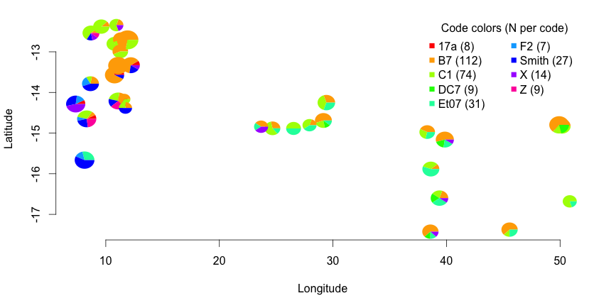

plotSpatialPies
===============

`plotSpatialPies` is an R function to plot pie charts representing fractions
of a code at particular locations.  Input is a data file containing sample
entries with (at least) the named columns `site`, `lat`, `long`, and `code`,
and optionally a second file containing containing named columns `code` and
'color' specifying the common (across-sites) color which should be used for
plotting the pie wedges for each code.  Output can be controlled with a number
of options.  This was originally developed to plot proportions of particular
genotypes at population locations, but it will now plot more general
proportions of each `code` at each `site`.

Requires the library `plotrix` for its very useful `floating.pie()` function.
At the R prompt, do

```R
install.packages("plotrix").
```

As a quick intro, try 

```R
plotSpatialPies(infile="example_data.txt")
```

There are some requirements for data file format, see the source file of the
function for more details.

Both the function and this documentation are very incomplete.  This is useful
for rapid examination of data, but will probably require source tweaking to get
publication-quality output that you want.  I'm providing it because I've found
it useful, and I hope it may be useful to someone.





Changelog
---------

* 0.2: more versatile avoidance of legend plot (add.legend=NA or =NULL)
* 0.1: initial release


Files
-----

Four files are provided: 

1. this `README.md`
2. `plotSpatialPies.R`, which should be `source`'d into R and defines the function `plotSpatialPies()`
3. `example_data.txt`, a very simple data file defining data for 20 samples, clustered into 3 sites, with samples having one of 5 codes.  
4. `example_colors.txt`, a file defining colors for each code in `example_data.txt`


If you have any problems, comments or improvements, please let me know.


Doug Scofield

douglasgscofield@gmail.com

Evolutionary Biology Centre
Uppsala University


Copyright (c) 2010, 2011, 2015 Douglas G. Scofield.   See LICENSE for
licensing infromation.

